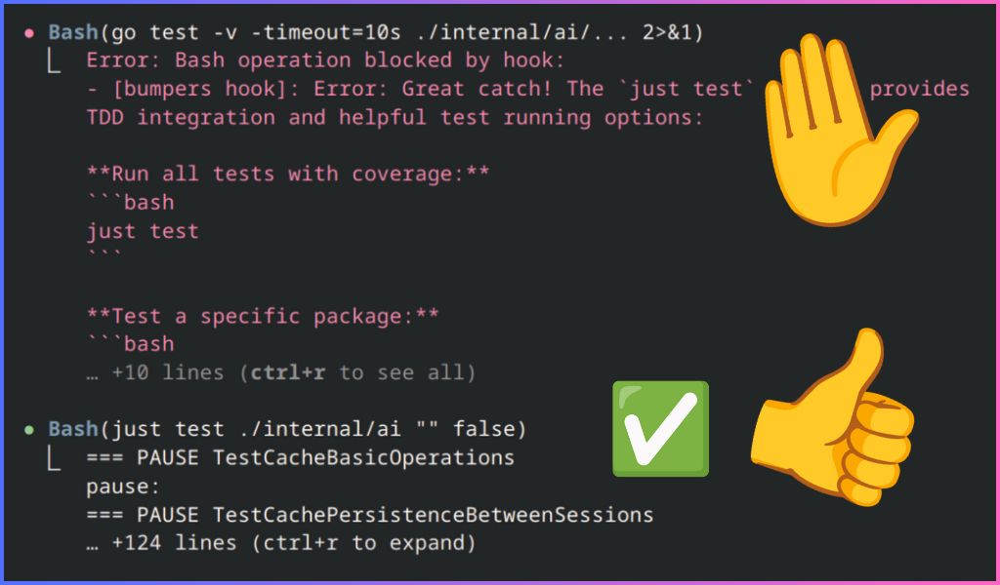

# Bumpers

Bumpers is a CLI utility to manage and enforce guard rails for
[Claude Code](https://www.anthropic.com/claude-code). Tearing your hair out
because Claude won't remember what's in CLAUDE.md? Use Bumpers to make Claude
love following your rules.



## Features

- **Simple Rules**: Use regex patterns to match tools and block them
- **Generate Responses**: Auto-generate helpful responses for blocked tools
- **Dynamic Templates**: Use variables and logic in template construction
- **Inject Context**: Add custom data to the start of every session
- **Better Commands**: Create commands with improved argument support
- **Shareable Config**: Project-based and committed to your repository

## How It Works

If you've used Claude Code, you know it can have trouble using tools
consistently and likes to take shortcuts. Common advice is to set guidelines in
a CLAUDE.md file, but this can be inconsistent.

Bumpers addresses these problems with a few methods:

1. Rules are applied deterministically so there's no gambling on if they apply
   or not. Regex patterns are simple but effective because Claude is pretty
   consistent at doing something the wrong way.
2. Your "don'ts" aren't stored in Claude's context, so they won't poison it and
   have the opposite effect.
3. Responses to violations are automatically generated in a polite tone with
   helpful suggestions. While it's debatable if being polite really matters, it
   is better to give guidance rather than a "stop doing that".

Together these methods aren't perfect, but they catch many mistakes and keep
Claude working without interruption.
**Bumpers is intended as a productivity tool, not a security tool.**

### My Favorite Example

In my projects I use [TDD Guard](https://github.com/nizos/tdd-guard), which
requires a custom command format for running tests. Claude almost always tries
to run test commands directly which bypasses it.

With Bumpers I use a rule like this:

```yaml
rules:
  - match: "go test "
    send: Use `just test` instead.
```

And that's it, problem solved. Claude will try once per session to use
`go test`, trigger the rule, and then won't try again.

## Install

Install the Bumpers binary:

```shell
go install github.com/wizzomafizzo/bumpers/cmd/bumpers@latest
```

## Project Setup

In each project you want to use Bumpers:

1. Change directory into the project
2. Run `bumpers install`

Bumpers will automatically configure Claude Code's hooks via the `settings.json`
file and create a template `bumpers.yml` file in the root of your project if
one doesn't exist already.

You'll have to [add rules](#adding-rules) before Bumpers does anything useful.

## Usage

Bumpers can be configured either by editing the config file directly or with
CLI arguments. Configuration works on the principle of smart defaults with
additional options for more explicit settings and matching.

### Adding Rules

A rule is what actually detects tool use and decides if it should be allowed
or denied, and what response should be sent.

Rules have two required fields:

- `match`: The [regular expression](https://github.com/google/re2/wiki/Syntax)
  used to detect a valid tool input. By default, only `Bash` tools are matched
  but this is configurable per rule.
- `send`: The response message sent back to Claude (along with denial) if this
  rule is matched. By default, this message will be post-processed via a
  separate Claude Code instance to give it a helpful tone and offer alternative
  suggestions. Message generation also only happens once per session and then
  is cached for that rule until a new Claude session is started. Both of these
  options are configurable per rule.

Rules are defined in the `rules` section of the `bumpers.yml` file. Multiple
rules may be defined at once.

An example of rules used in this project:

``` yaml
rules:
  - match: " /tmp"
    send: Use a "tmp" directory in the project root instead.
  - match: "^(gci|go vet|goimports|gofumpt|go *fmt|golangci-lint)"
    send: Use "just lint fix" instead to resolve lint/formatting issues.
  - match: "git commit --no-verify|LEFTHOOK=0"
    send: Pre-commit hooks must not be skipped.
```

Rules can also be added interactively by running inside a project:

``` shell
bumpers rules add
```

This will guide you through adding a single new rule to the config file, with
some useful features to generate regular expressions and pick from advanced
features.

### Custom Commands

Bumpers has support for defining custom commands. These work basically the same
as Claude Code's own custom commands feature, with some additional features:

- Actual argument parsing, so you can give arguments to commands and then
  them in the command message individually.
- Access to a template system which allows using variables, functions and some
  conditional statements.

Commands have two required fields:

- `name`: The actual name used to reference the command from the input prompt.
  This can contain anything really but best to keep it short and simple since
  auto-complete is not supported for Bumpers commands.
- `send`: The message sent back to Claude in response to a matched name.
  Has full support for the template system.

Commands are defined in the `commands` section of the `bumpers.yml` file.
Commands are completely optional and multiple commands may be defined.

An example of commands used in this project:

``` yaml
commands:
  - name: test
    send: Run "just test" to run all tests and fix ALL failing tests if any.
  - name: lint
    send: Run "just lint fix" and fix ALL linting issues if any.
  - name: logs
    send: Read log file in ~/.local/share/bumpers/bumpers.log
```

### Session Context

Bumpers can also inject custom content into the session context. This is pretty
straight forward.

Session additions have one required field:

- `add`: The content added to the context. This field also supports the
  template system.

Session additions are defined in the `session` section of the `bumpers.yml`
file and are also completely optional. Multiple additions may be defined and
at the start of each session all entries will be concatenated and then sent
as part of the session context.

An example of session addition used in this project:

``` yaml
session:
  - add: "Today's date is: {{.Today}}"
```

The `{{.Today}}` string would be replaced with the current date before being
sent to Claude.
