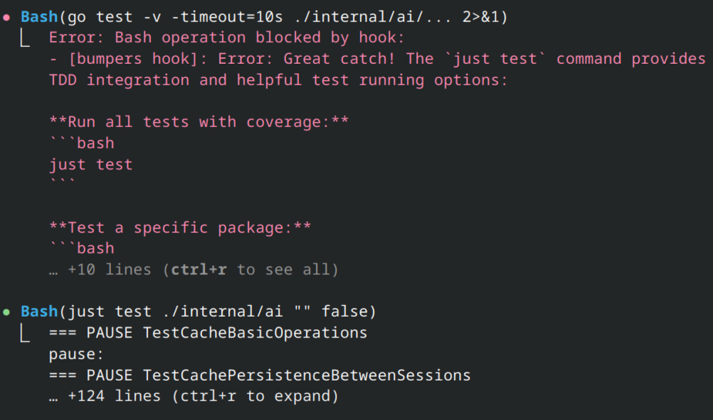

# Bumpers

Bumpers is a CLI utility to manage and enforce guard rails for Claude Code. Tearing your hair out because Claude won't remember what's in CLAUDE.md? Use Bumpers to make Claude love following your rules.



## Features

- **Simple Config**: Use regex patterns to match tool use and block
- **Generated Responses**: Auto-generate helpful responses for blocked tools
- **Response Templates**: Create dynamic responses using template extension
- **Inject Context**: Add custom data automatically at the start of every session
- **Custom Commands**: Create custom commands with enhanced argument parsing
- **Shareable**: Config is project-based and committed to your repo

## How It Works

If you use Claude Code, you know it can be bad at using tools consistently and tends to work around rules. The most common advice is to give it a list of guidelines to follow in the CLAUDE.md file, with a lot of conflicting advice on how to structure it, and with very inconsistent results.

Bumpers addresses this with a few methods:

1. Rules are applied deterministically so there's no gambling on if they work or not. Regex patterns are simple but effective because Claude is quite consistent at doing something the wrong way.
2. Your "don'ts" are no longer stored in Claude's context, so they can no longer poison it and have the opposite effect.
3. Responses to violations are automatically generated in a positive tone with helpful suggestions. This is how you're supposed to do it, but it's hard to be bothered not just going "don't do that" after the tenth time.

In combination, these methods aren't perfect, but they catch the vast majority of mistakes and keep Claude working without interruption or mistakes. **Bumpers is intended as a productivity tool, not a security tool.**

### My Favorite Example

In many of my projects I use TDD Guard which requires a custom command format for running tests. Claude almost always tries to run `go test` directly, bypassing TDD Guard.

Now I use Bumpers with a rule like this:

```yaml
rules:
  - match: "go test "
    send: Use `just test` instead.
```

And that's it, problem solved. Claude will try once per session to use `go test`, trigger the rule, and then won't try again.

## Installation

```shell
go install github.com/wizzomafizzo/bumpers/cmd/bumpers@latest
```

## Usage

In your project, run `bumpers install` to create a template `bumpers.yml` file and configure Claude Code's hooks. Restart Claude Code if you already have it running.

Then you can edit the `bumpers.yml` file to define your rules. Rules are read on-the-fly every time Claude does something so you don't need to restart it again or reinstall Bumpers.
